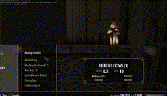

REQUIREMENT:
Download and install Tesseract OCR for Windows: https://github.com/UB-Mannheim/tesseract/wiki
Needs to install to this location: C:/Program Files/Tesseract-OCR/tesseract.exe
Packages should be installed as indicated in Requirements.txt

RUNNING THE PROGRAM:
Run main.py
Navigate to the top of your ingredients list and press CTRL+ALT. Parsed results will be outputted into Parsed_Character_Ingredients.csv
